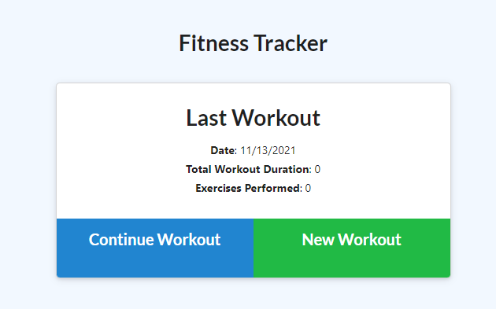
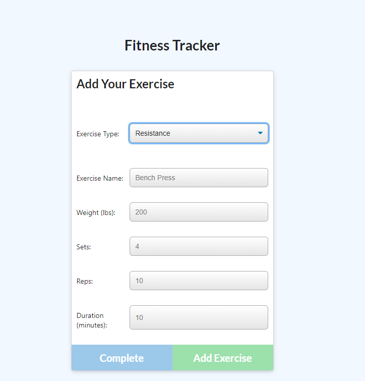
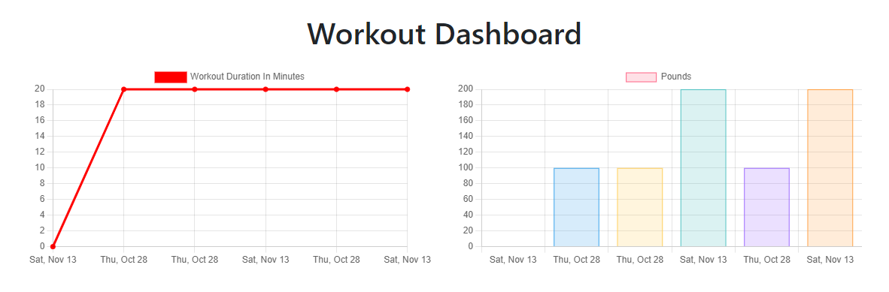

# Fitness Tracker

## Description

Track your workouts with the fitness tracker. The application will track each all of your resistance and cardio excercise. 
the duration of your workout and the weight progression. 

## Table of Contents

* [Installation](#installation)
* [Usage](#usage)
    * [Screenshots](#screenshots)
    
* [Credits](#credits)
* [License](#license)

## Installation

1. Clone repository. 
2. Check in routes/api-routes and comment in block of code if you want the database to be prepopulated with dummy values
3. npm install
4. node server.js

Running seeders/seed.js is optional to have a prepopulated database.

    

## Usage

### Screeshots

1. Homepage displaying last workout

2. Creating Workouts

3. Last Week's Summary

## Credits

### Author

-  Jose Avalos: [portfolio](https://pepsi1397.github.io/08_portfolio/)
-  Github: [Pepsi1397](https://github.com/pepsi1397)

## License

 

    

